# Foc-Controller
无刷电机驱动器软硬件

# 什么是FOC
FOC(Field Oriented Control)即磁场定向控制技术，又称为矢量控制(Vector Control)，是目前无刷直流电机(BLDC)和永磁同步电机(PMSM)高效控制的最佳选择。使用FOC技术可以精确地控制磁场大小与方向，使得电机转矩平稳、噪声小、效率高，并且具有高速的动态响应。FOC可以分为有感FOC和无感FOC，无感FOC相较于有感FOC，少了编码器反馈电机转子的位置信息，所以在控制中需要通过采集电机相电流，使用位置估计算法来计算转子位置，控制难度较大，下文默认FOC仅代表有感FOC。
FOC的本质是将三项无刷电机解耦成类似直流有刷电机的控制方法，简化电机控制。
<!-- more -->
# FOC原理
FOC的控制框图如下：

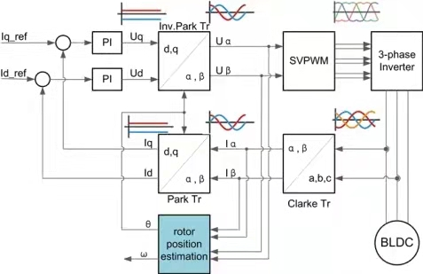

由图可知，FOC流程为：
1. 使用Clarke变换将电机三项相差120°的电流(a,b,c)变换成相差90°的电流(Iα，Iβ)；
2. 使用Park变换将Iα、Iβ变换成直流量Id和Iq
3. 输入Id_ref、Iq_ref大小，与Park变换后的Id、Iq做PI控制，得到Ud、Uq
4. 使用逆Park变换将Ud、Uq变换成Uα、Uβ
5. Uα、Uβ通过SVPWM输出到电机绕组

FOC的核心是电流控制，只有具备电流控制的方法才是真FOC(区别于用电压近似等效电流的控制方法)。但是无刷电机三项电流是相差120°的弦波，对于控制系统来说控制三个非线性的量是不太容易的，因此FOC通过Clark将自然坐标系下的Ia Ib Ic变换到α-β坐标系得到Iα Iβ，再通过Park变换将Iα Iβ变换到旋转D-Q坐标系得到Id Iq，于是三个非线性量Ia Ib Ic通过两次变换变成易于控制的线性变量Id、Iq，电流在三个坐标下的示意图如下：

### 自然坐标系

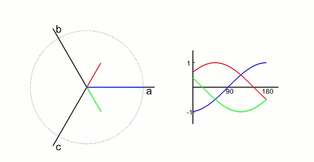

### α-β坐标系

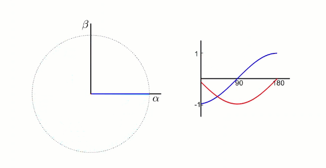

### D-Q坐标系

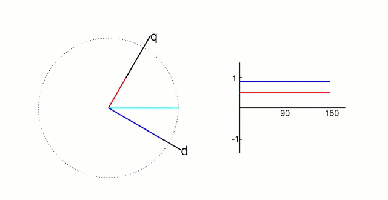

* Id用于产生磁通(效果是发热)
* Iq用于产生力矩(效果是旋转)

很明显Id是负面的量，通过PI控制尽可能将它控制在0，Iq则是的力矩(电流和力矩等效)输出，所以系统输入量Id_ref等于0，Iq_ref等于期望力矩(或电流)。

# FOC实现过程
## 电流采样
上文说过FOC的核心是电流控制，电流控制的基础就是能够准确进行电流采样，电流采样的方法比较多，这里只介绍一种比较简单比较常用的方法--采样电阻+运放。

采样电阻通常被放置在下桥臂，在mos管下管打开时采样

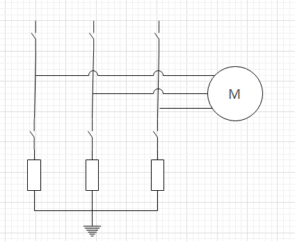

也可以只采样两项电流

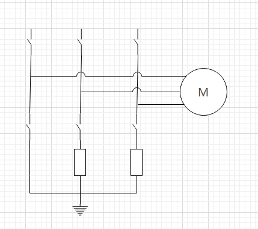

根据基尔霍夫定律 Ia + Ib + Ic = 0，只需要知道其中两项便可算出第三项的大小。不过工程和理论毕竟有差异，电路板制造、布线、电阻运放精度、ADC精度等都会使采样结果误差变大，使用三项采样可以一定程度上校准采样误差。

单片机是不能直接采样电流的，只能通过ADC采样电压值，再根据欧姆定律算出来电流。为了不影响电机控制的性能，采样电阻通常会很小，常用0.1欧或0.01欧，所以分压也相应很低，需要使用运算放大器做电压放大，采用的是偏置+放大的运放电路。

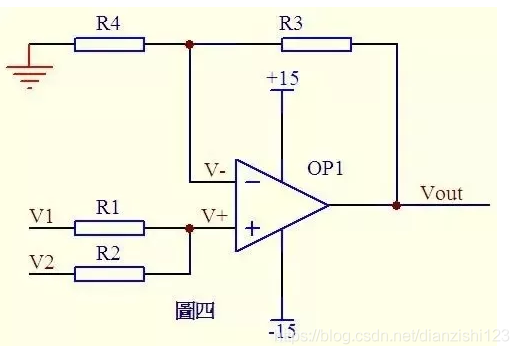

* 上图中：Vout = (R3+R4)/R4  *  (R2 * V1 + R1 * V2)/(R1+R2)
* 令R3 = R1, R4 = R2,可化简成 Vout = V1 + V2 * R1/R2
* V1输入单片机工作电压3.3V的一半1.65V，V2输入采样电阻电压
* 最后化简得到Vout = 1.65 + V2 * R1/R2， 很明显电压放大倍数是R1和R2的比值

> 电流采样时有个误区，有人不理解为什么在mos管下管开启时进行采样，下管开启意味着上管关闭，此时已经没有电压输入，为什么还可以进行电流采样，网络上也没有看到相关博主的解释。这是因为电机是感性负载，三项绕组等效于三个电感，而电感的电流不会突变，因此在三个下管全部打开的时候电流在电机内部形成了回路，尽管没有电源参与，绕组上仍然是有电流通过的。

## Clark变换
电流采样后便是将Ia Ib Ic变换到静止坐标系α β下

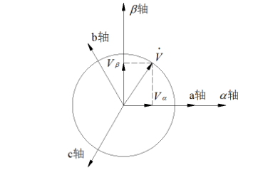

变换公式：


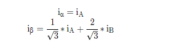


程序实现
```
void FocConverter::Clarke(float iA, float iB, float iC){
	this->Ialpha = iA;
	this->Ibeta = (iA + 2.0f * iB) / FOC_SQRT_3;
}
```
## Park变换
电流采样后便是将Ia Ib Ic变换到静止坐标系α β下

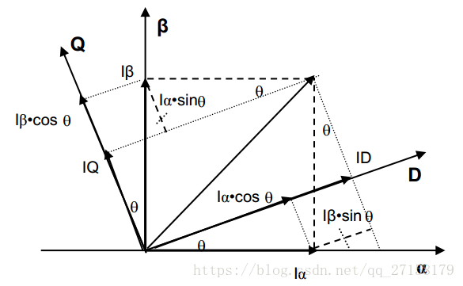

其中θ角是当前电机的角度，可以通过编码器获得
> θ是电角度，通过编码器获得的角度并不能直接使用，需要根据电机的磁极对数进行转换

变换公式：

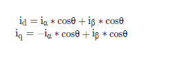


程序实现
```
void FocConverter::Park(float iAlpha, float iBeta, float theta){
	float _Cos = cos(theta);
	float _Sin = sin(theta);

	this->Id =  iAlpha * _Cos + iBeta * _Sin;
	this->Iq = -iAlpha * _Sin + iBeta * _Cos;
}
```
## PID控制
将Park变换后的Id和Iq，与输入的Id_ref(通常为0)和Iq_ref经过PID运算输出Ud和Uq，通常情况下只需要使用Pi即可

## 逆Park变换
程序实现
```
void FocConverter::RevPark(float uD, float uQ, float theta){
	float _Cos = cos(theta);
	float _Sin = sin(theta);

	this->Ualpha = uD * _Cos - uQ * _Sin;
	this->Ubeta  = uD * _Sin + uQ * _Cos;
}
```
# SVPWM
 SVPWM是由三相功率逆变器的六个功率开关元件组成的特定开关模式产生的脉宽调制波，能够使输出电流波形尽可能接近于理想的正弦波形。空间电压矢量PWM与传统的正弦PWM不同，它是从三相输出电压的整体效果出发，着眼于如何使电机获得理想圆形磁链轨迹。SVPWM技术与SPWM相比较，绕组电流波形的谐波成分小，使得电机转矩脉动降低，旋转磁场更逼近圆形，而且使直流母线电压的利用率有了很大提高，且更易于实现数字化。通俗化理解，把PMSM想象成两块同心的磁铁，两块磁铁是相吸的，因此当用手拨动外面的磁铁绕组圆心转动时，里面的磁铁也会跟着转动，这其实就是PMSM的本质了。PMSM的转子是永磁铁，定子是绕组，我们用电路控制定子绕组产生旋转的磁场，里面的转子磁铁就会跟着转动，这个磁场的大小最好恒定，不然一会儿大一会儿小，转子受到的牵引力也就一会儿大一会儿小，影响运动性能。FOC需要一个算法来控制定子绕组的输出，使其产生一个恒定的旋转磁场，这个算法就是SVPWM。

 要得到一个恒定大小的旋转磁场，可以先来得到一个恒定大小的旋转电压矢量

 

 从上图可知，我们可以通过互差120度，大小随着时间按正弦规律变化的3个分矢量来合成一个大小不变旋转的总矢量。于是问题又变成了：如何得到大小随着时间按正弦规律变化的3个分矢量呢？我们先回到电机上，其实这3个分矢量就对应了电机的3个绕组，3个绕组就是互差120度的，只要再控制绕组上的电压大小按照正弦规律变化，是不是就可以得到大小不变旋转的总矢量呢？看下面电机定子的坐标系图：

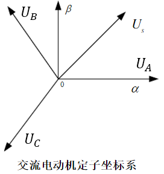

驱动器的控制电路如下：

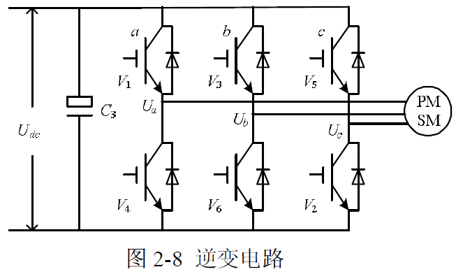

我们只能控制6个管子的开关而已，看来直接通交流电是不行了。于是我们只能控制PWM的占空比来等效正弦：

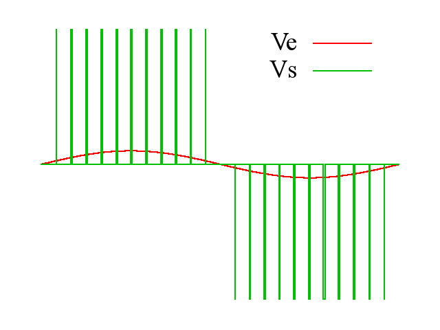


```
void SvPwm::Svpwm(float uAlpha, float uBeta){
	float U1, U2, U3;
	float T1, T2, T3, T4, T5, T6, T7, Ts = 1.0f;

	U1 =  uBeta;
	U2 =  uAlpha * SVPWM_SQRT3_2 - uBeta / 2; // -temp3
	U3 = -uAlpha * SVPWM_SQRT3_2 - uBeta / 2;//-temp2

	uint8_t A = 0, B = 0, C = 0;
	if (U1 > 0) A = 1;
	if (U2 > 0) B = 1;
	if (U3 > 0) C = 1;

	uint8_t N = 4*C + 2*B + A;
	switch (N) {
		case 3: this->Sector = 1; break;
		case 1: this->Sector = 2; break;
		case 5: this->Sector = 3; break;
		case 4: this->Sector = 4; break;
		case 6: this->Sector = 5; break;
		case 2: this->Sector = 6; break;
	}

    switch (this->Sector) {
        case 1:
            T4 = SVPWM_SQRT3 * Ts / this->Udc * U2;
            T6 = SVPWM_SQRT3 * Ts / this->Udc * U1;
            T7 = (Ts - T4 - T6) / 2;
            break;
        case 2:
            T2 = -SVPWM_SQRT3 * Ts / this->Udc * U2;
            T6 = -SVPWM_SQRT3 * Ts / this->Udc * U3;
            T7 = (Ts - T2 - T6) / 2;
            break;
        case 3:
            T2 = SVPWM_SQRT3 * Ts / this->Udc * U1;
            T3 = SVPWM_SQRT3 * Ts / this->Udc * U3;
            T7 = (Ts - T2 - T3) / 2;
            break;
        case 4:
            T1 = -SVPWM_SQRT3 * Ts / this->Udc * U1;
            T3 = -SVPWM_SQRT3 * Ts / this->Udc * U2;
            T7 = (Ts - T1 - T3) / 2;
            break;
        case 5:
            T1 = SVPWM_SQRT3 * Ts / this->Udc * U3;
            T5 = SVPWM_SQRT3 * Ts / this->Udc * U2;
            T7 = (Ts - T1 - T5) / 2;
            break;
        case 6:
            T4 = -SVPWM_SQRT3 * Ts / this->Udc * U3;
            T5 = -SVPWM_SQRT3 * Ts / this->Udc * U1;
            T7 = (Ts - T4 - T5) / 2;
            break;
    }


    float Ta;
    float Tb;
    float Tc;
    switch (this->Sector) {
        case 1:
            Ta = T4 + T6 + T7;
            Tb = T6 + T7;
            Tc = T7;
            break;
        case 2:
            Ta = T6 + T7;
            Tb = T2 + T6 + T7;
            Tc = T7;
            break;
        case 3:
            Ta = T7;
            Tb = T2 + T3 + T7;
            Tc = T3 + T7;
            break;
        case 4:
            Ta = T7;
            Tb = T3 + T7;
            Tc = T1 + T3 + T7;
            break;
        case 5:
            Ta = T5 + T7;
            Tb = T7;
            Tc = T1 + T5 + T7;
            break;
        case 6:
            Ta = T4 + T5 + T7;
            Tb = T7;
            Tc = T5 + T7;
            break;
    }

	this->T1 = (Ta * this->PERIOD);
	if (this->T1 > this->PERIOD)	this->T1 = this->PERIOD;
	if (this->T1 < 0)	this->T1 = 0;

	this->T2 = (Tb * this->PERIOD);
	if (this->T2 > this->PERIOD)	this->T2 = this->PERIOD;
	if (this->T2 < 0)	this->T2 = 0;

	this->T3 = (Tc * this->PERIOD);
	if (this->T3 > this->PERIOD)	this->T3 = this->PERIOD;
	if (this->T3 < 0)	this->T3 = 0;
}
```


  参考链接：
  1. https://zhuanlan.zhihu.com/p/364247816
  2. https://blog.csdn.net/differently1234/article/details/118084870
  3. https://blog.csdn.net/qlexcel/article/details/74787619#comments
  4. https://blog.csdn.net/qq_27158179/article/details/82981229
  6. https://blog.csdn.net/wofreeo/article/details/82968439
  7. https://blog.csdn.net/chenjianbo88/article/details/53027298
  8. https://blog.csdn.net/qlexcel/article/details/74787619#comments
  9. https://great.blog.csdn.net/article/details/103672042?spm=1001.2101.3001.6661.1&utm_medium=distribute.pc_relevant_t0.none-task-blog-2%7Edefault%7ECTRLIST%7EPayColumn-1.pc_relevant_default&depth_1-utm_source=distribute.pc_relevant_t0.none-task-blog-2%7Edefault%7ECTRLIST%7EPayColumn-1.pc_relevant_default&utm_relevant_index=1